# Circuit Runtime Evaluation

Simple experiments evaluating the duration of circuit execution using different frameworks for evaluation of
- no shots (None): analytical evaluation of the cirucuit -> statevector backend is used
- [2**7..2**12] shots: measurements are taken -> qasm backend
Plots in "plots/duration_*.png" show the results either with varying circuit depth or width (num. of qubits).
Created using "test_duration.py".

Real quantum devices can be specified in the config and creating a file named "ibmq_access" in the project root directory providing variables "hub", "group", "project" and "token".

## Results

- Framework: qiskit
- Qubits: 10
- Depth: [1..10]
- Evals: 20
- Shots: [None, 2**7, .., 2**10]

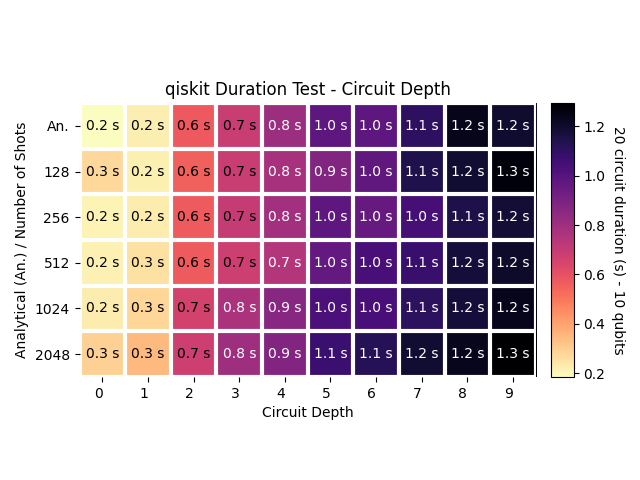

---

- Framework: qiskit
- Qubits: [1..10]
- Depth: 10
- Evals: 20
- Shots: [None, 2**7, .., 2**10]

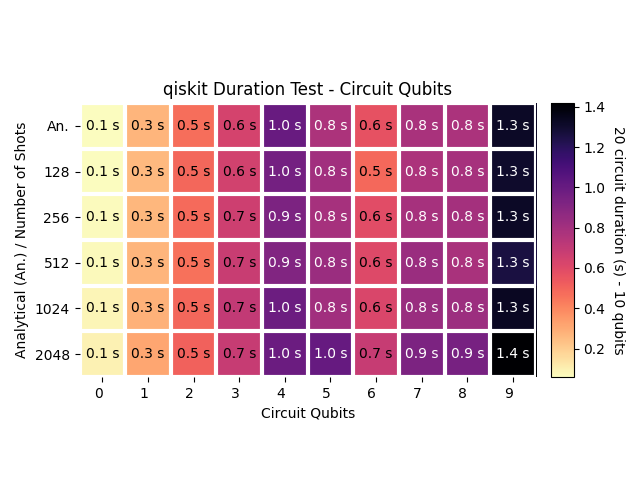

---

- Framework: pennylane
- Qubits: 10
- Depth: [1..10]
- Evals: 20
- Shots: [None, 2**7, .., 2**10]

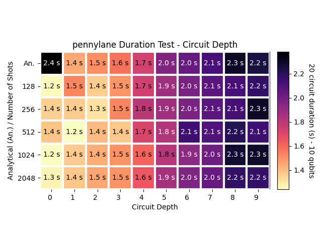

---

- Framework: pennylane
- Qubits: [1..10]
- Depth: 10
- Evals: 20
- Shots: [None, 2**7, .., 2**10]

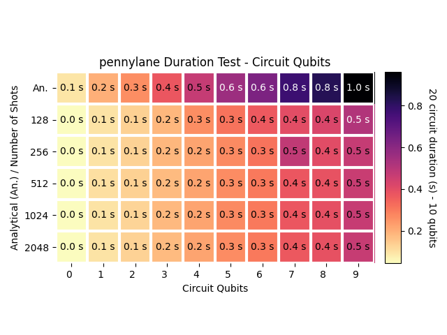

---
- Framework: cirq
- Qubits: 10
- Depth: [1..10]
- Evals: 20
- Shots: [None, 2**7, .., 2**10]

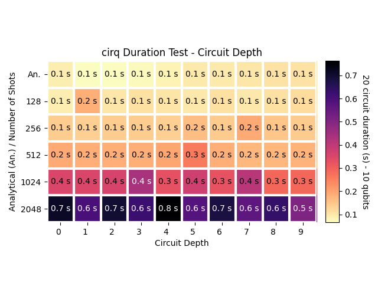

---

- Framework: cirq
- Qubits: [1..10]
- Depth: 10
- Evals: 20
- Shots: [None, 2**7, .., 2**10]

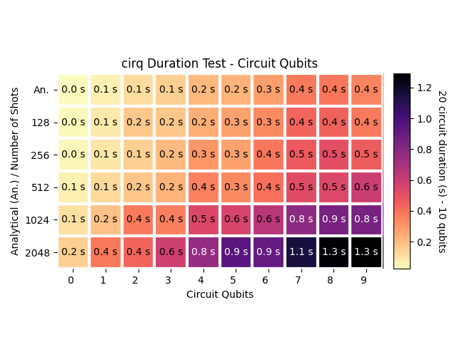

---

- Framework: numpy
- Qubits: 7
- Depth: [1..10]
- Evals: 20
- Shots: [None, 2**7, .., 2**10]

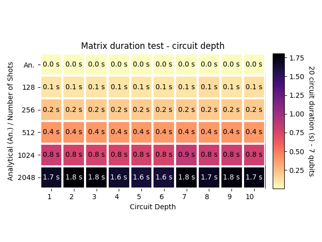

---

- Framework: numpy
- Qubits: [1..7]
- Depth: 10
- Evals: 20
- Shots: [None, 2**7, .., 2**10]

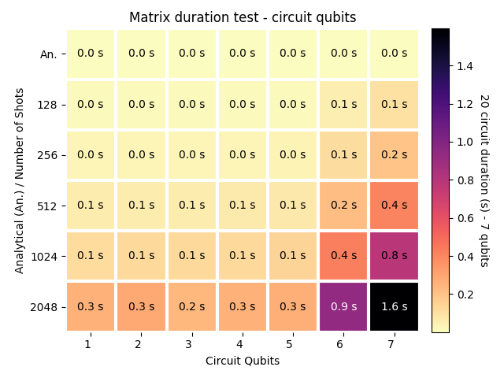

---

- Framework: qibo
- Qubits: 7
- Depth: [1..10]
- Evals: 20
- Shots: [None, 2**7, .., 2**10]

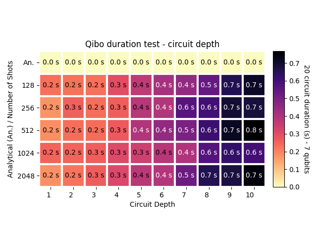

---

- Framework: qibo
- Qubits: [1..7]
- Depth: 10
- Evals: 20
- Shots: [None, 2**7, .., 2**10]

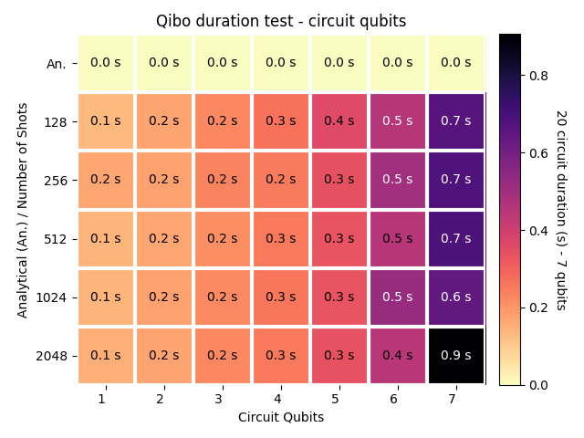

---

- Framework: real quantum computer
- Qubits: 7
- Depth: [1..10]
- Evals: 20
- Shots: [None, 2**7, .., 2**10]

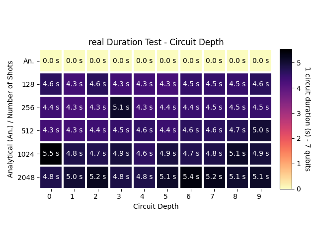

---

- Framework: real quantum computer
- Qubits: [1..7]
- Depth: 10
- Evals: 20
- Shots: [None, 2**7, .., 2**10]

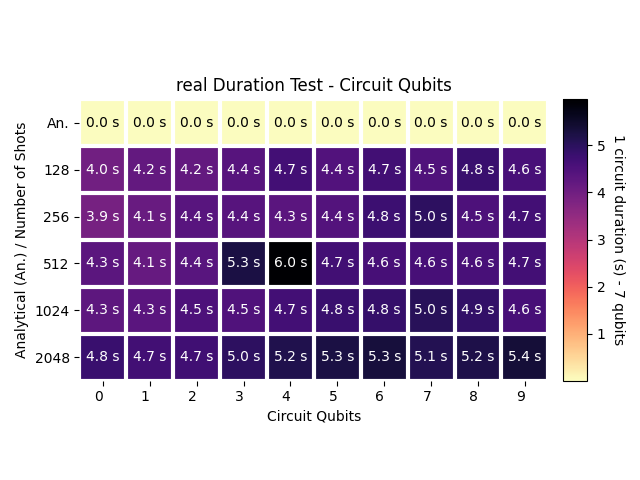

---

## Further experiments

Plots in "plots/expval_*.png" show variations of an RX gate acting on a single qubit with increasing rotation angles.
Just a dummy experiment to show impact of measurments.
Created using "qiskit-test_expval.py".