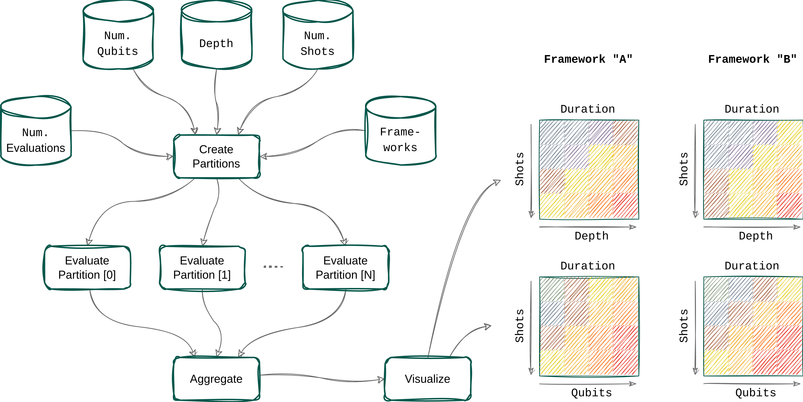

# QUAFEL - QUAntum Framework EvaLuation

[](https://github.com/cirKITers/quafel/actions/workflows/quality.yml) [](https://github.com/cirKITers/quafel/actions/workflows/test.yml) [](https://github.com/cirKITers/quafel/actions/workflows/docs.yml)

## 📜 About

Not to be confused with the [Quaffle](https://harrypotter.fandom.com/wiki/Quaffle) :wink:



See [our poster](https://bwsyncandshare.kit.edu/s/CdnD6MEsNwYgJMd) contributed to the [QTML23](https://indico.cern.ch/event/1288979/) for more details.

## 🚀 Getting Started

```
pip install quafel
```
or
```
poetry add quafel
```

To install our package from [PyPI](https://pypi.org/project/quafel/).
You can find details on how to use it and further documentation on the corresponding [Github Page](https://cirkiters.github.io/quafel/).

We're also working on a [software](https://github.com/cirKITers/Quafel-PSE-2024) to make the benchmarking results available online. Stay tuned!

## 🚧 Contributing

Contributions are very welcome! See [Contribution Guidelines](https://github.com/cirKITers/quafel/blob/main/CONTRIBUTING.md).