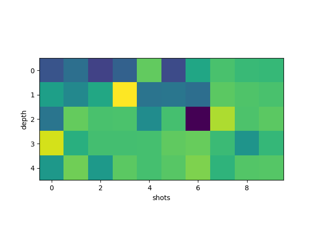
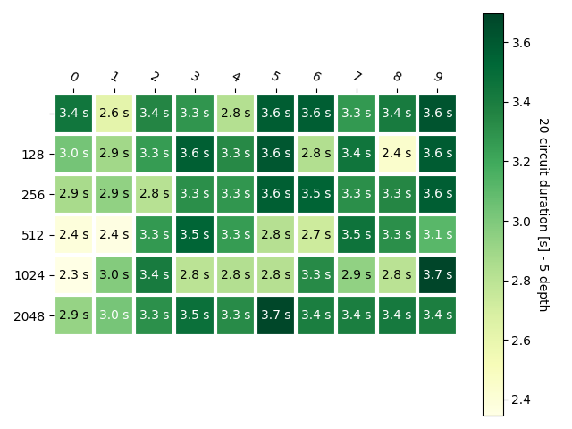

# Qiskit Circuit Runtime Evaluation

Simple experiments evaluating the duration of circuit execution using either the statevector or qasm backend for evaluation of
- no shots (None): analytical evaluation of the cirucuit -> statevector backend is used
- [2**7..2**12] shots: measurements are taken -> qasm backend
Plots in "plots/duration_*.png" show the results either with varying circuit depth or width (num. of qubits).
Created using "qiskit-test_duration*.py".

## Results

- Qubits: 2
- Depth: [1..10]
- Shots: [None, 2**7, .., 2**10]

---

- Qubits: 2
- Depth: [1..10]
- Shots: [None, 2**7, .., 2**10]

## Further experiments

Plots in "plots/expval_*.png" show variations of an RX gate acting on a single qubit with increasing rotation angles.
Just a dummy experiment to show impact of measurments.
Created using "qiskit-test_expval.py".